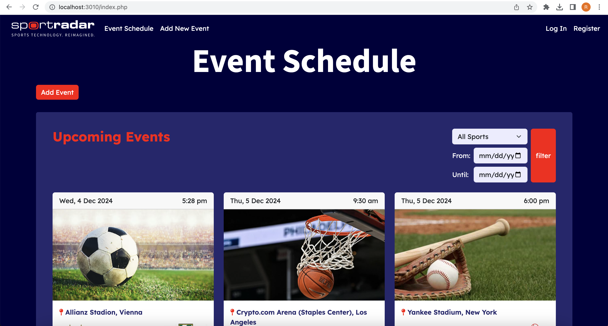
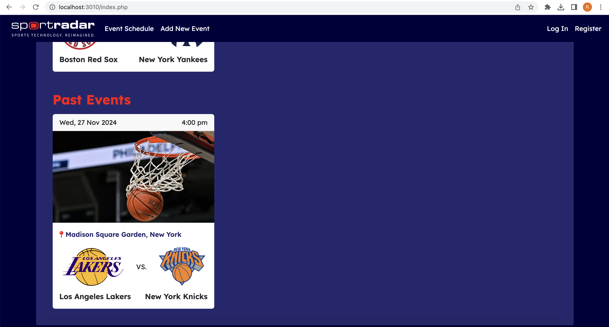
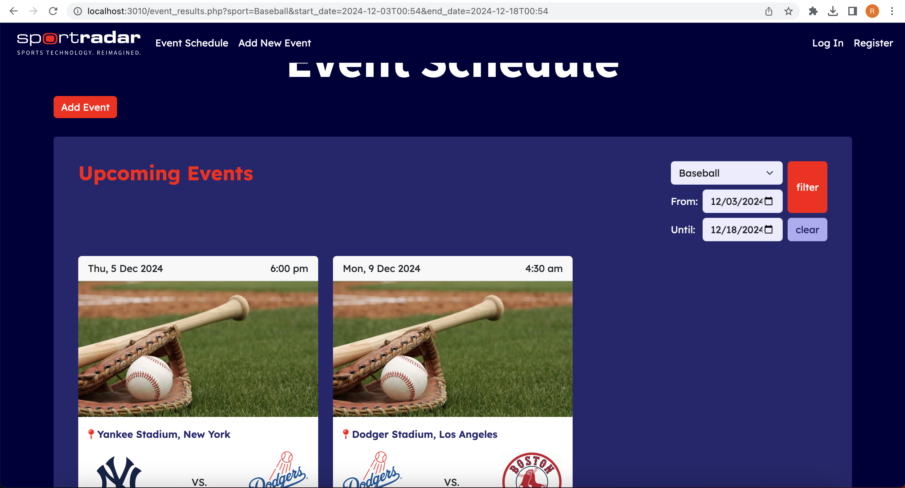
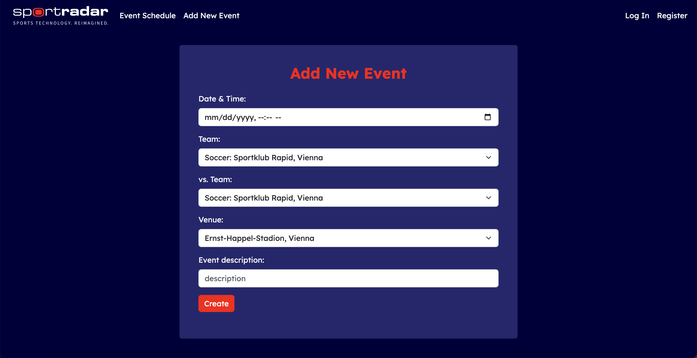

# Sportradar Event Schedule

&ndash; this project has been created as part of the application process for Sportradar Coding Academy, Coding Exercise (BE) &ndash;

## About

The Sportradar Event Schedule brings to you a lively display of all the hottest sports events around the world - from soccer to baseball to basketball, using primarily PHP, MYQSL, HTML & CSS, using some OOP and elementary concepts of the MVC framework (please note I have very minimal experience with this, so tried my best to make the most out the situation - but it is not a full MVC program or fully object-oriented!).  
You can filter through events to get results based on your favorite sport or a date range, and can add new events to the database.

## How To Set Up

This project uses XAMPP and phpMyAdmin to run the database local hosting and interaction. It is recommended to have these set up as a first stage, along with PHP installed in order to run the Event Schedule successfully.  
The database creation file included in the project files (sportradar.sql) already has sample data inserted into it, including a database creation query, so it's good to go with the upload via phpMyAdmin. If you'd like to see a visual layout of the database to get a good grasp of it, please see the ERD at erd.drawio.  
You can then run a local host server and off we go - the Event Schedule is ready!

## Details & How To Use

The database architecture of this project has been modeled to maintain event data and its addition, while have it connecting to team, venue and sport information, to retrieve all relevant display data for the user in a clean, 3NF manner. It includes an Event entity, Team, Venue and Sport entities (all including foreign key connections between them to communicate properly), and a many-to-many table for Venue_Sport, as sport events can be held at a variety of venues and venues can often hold events of various different sports (Staples Center anyone?).  
In the project's lightly MVC-oriented file structure, it includes an Event class Model with functions that create objects from the class, insert new ones into the database, and an EventController which holds functions that pertain to the Event class but aren't directly performed on an object of Event, and mainly - they process data collected from the user's input on View pages (index.php, event_results.php & create_event.php), and tell the View or the Model what action should be taken.  
All events, both past and future, are displayed on the index.php page, with the option to filter through events based on sport or date range (it is not necessary to fill in all 3 fields to filter the events).
After submitting your filtering request, you will be transferred to the event_results.php page, with your requested filter displayed. You can always continue filtering through from the page and the display will be updated accordingly.  
If you'd like to add a new event, click the button on the index page or navbar button (the navbar log in & register buttons are just placeholders - please ignore), and you'll be transferred to the create_event.php page, where you'll find a form to fill out with all the event details. Beware of error messages in the form in case you enter illogical data - e.g. a soccer team cannot play a basketball team!  

🏀⚽️⚾ Enjoy playing around ⚽️🏀⚾️

## Visuals of the Event Schedule in Action
index.php:

filtering through events:

adding a new event:

